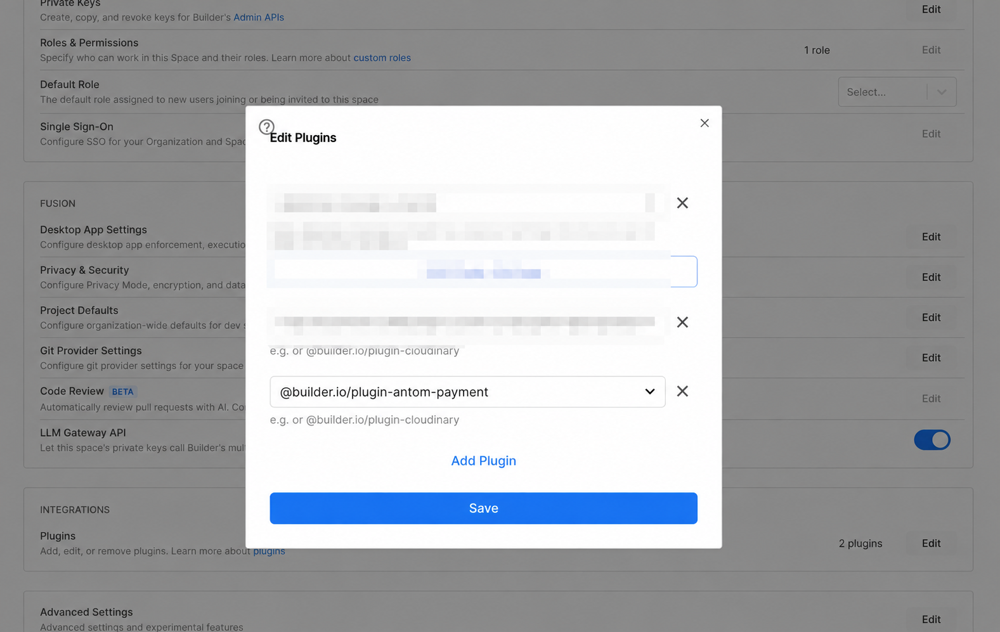
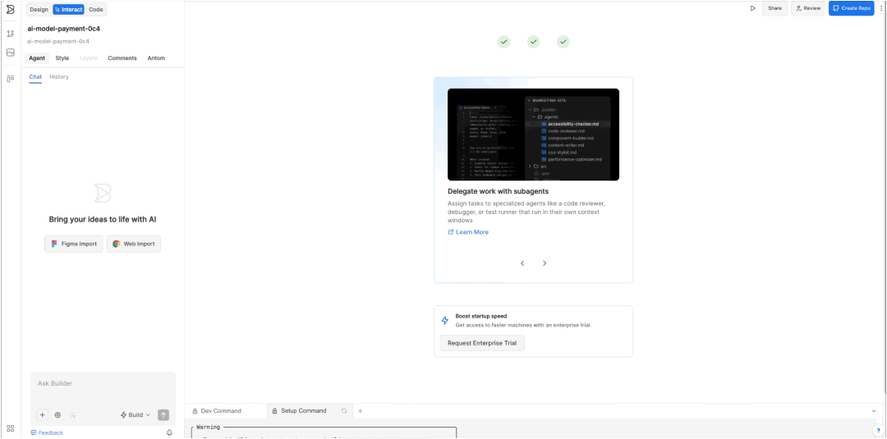

# Antom Payment Plugin for Builder.io

> Development distribution. GitHub Pages publishes the browser plugin and pinned Skill data after its workflow succeeds; it does not publish an npm package. The GitHub source is verified in the browser. Import into a Builder project and destination-file verification require separate cloud acceptance and are not proven by a green build.

Antom's Builder.io editor plugin helps teams install reviewed, pinned Antom Skills once per project, then use them through ordinary Builder Agent chat. No additional backend service or MCP connection is required.

The plugin:

- Adds an `Antom` editor tab.
- Stores optional, non-secret Antom reference values in Builder plugin settings.
- Creates one revision-pinned GitHub file-import request for Builder Agent in the connected cloud project, without an installation command.
- Supports payment integration and supplied-file settlement analysis, including the required supporting scripts.
- Includes validated, non-secret payment configuration in the setup request and updates `.env.example` only.
- Keeps local installer commands, configuration exports and complete Skill ZIP downloads as optional alternatives.
- Lets projects select RSA or API key authentication for ordinary payment API requests; notify-related interfaces always retain RSA.
- Links to official Antom CLI setup guidance; it does not install, authenticate or execute the CLI.

It never stores an API key or merchant private key, or authenticates Antom requests in the browser. Authentication, signing and secret handling must remain in trusted server-side code generated for the target project.

## Install in a Builder Space



### From GitHub Pages (no npm publication)

1. In this repository, select **Settings → Pages → Source → GitHub Actions**.
2. Wait for **Actions → Publish plugin to GitHub Pages** to finish successfully on `main`.
3. In Builder, open your **Space settings → Integrations → Plugins → Edit** and add:

   ```text
   https://mo-cha-lauren.github.io/builder-io-plugin/plugin.system.js?pluginId=@antglobal/builder-io-plugin-antom-payment
   ```

4. Remove an older URL for this same plugin from the Space plugin list if present, then reload Builder. Do not install duplicate copies of the same plugin ID.
5. In the **Antom** tab, keep **Installer source → GitHub (no npm)**, select **Payment integration**, review non-secret settings, and copy the setup request into the current target project's Agent chat.

Use an ordinary target application, not this plugin's source repository. The
target must not have preinstalled Antom Skills or `tools/antom-builder` when
testing a first installation. GitHub mode imports complete files using existing
permitted Agent web-reading and file-editing tools; it does not run an installer,
require npm, add a backend/MCP service, or authorize command-policy changes.

The panel verifies the pinned manifest and, before copying, the selected source
files' exact byte lengths and SHA-256 hashes. **Source manifest verified** does not
mean the target project is installed. The Agent must read all source text in full,
preflight every destination/config conflict, create only missing files and read
the result back. Stop if native tools are denied/unavailable, return transformed
or truncated content, cannot establish safe project paths, or find conflicts.
Do not work around the failure with shell commands or a preloaded test package.

For payment integration expect **5 files** under
`.builder/skills/antom-integration/`; reconciliation adds **19 files** under
`.builder/skills/antom-reconciliation-expert/`. Configuration touches only
`.env.example`, with secrets left empty. Bill-only import leaves it untouched.
Ask Agent to report changed/skipped/conflicting files and full read-back results.
If native destination hashing is not available, it must report
**Destination SHA-256 not verified**, not invent a hash or claim byte-level
verification. Start a new chat to test Skill discovery only after complete import,
keeping verification and runtime limitations explicit. This route still requires
actual Builder cloud acceptance; source verification alone is not sufficient.

The site hosts only the current deployment's revision. Old plugin builds fail
closed when their pinned data is no longer available; reload the current plugin
instead of silently selecting another revision. The site root and `release.json`
show the deployed commit and plugin hash. Local build dependencies still use npm;
no npm registry release or npm command is needed by the GitHub import request.

### From Builder Integrations (after listing)

1. In Builder, open **Settings → Integrations**.
2. Find **Antom Payment** and select it.
3. Follow the configuration prompt, then reload Builder.

### From npm (after package publication)

1. In Builder, open **Settings → Integrations**.
2. Find **Plugins**, select **Edit**, then **Add Plugin**.
3. Enter `@antglobal/builder-io-plugin-antom-payment` or pin a reviewed version with `@antglobal/builder-io-plugin-antom-payment@<version>`.
4. Save and reload Builder.

The two installation routes above require a corresponding Builder listing or
public npm release. Publishing this source repository does not make either
route available. GitHub Pages and local development are separate loading routes.

## Use the plugin



The demo above shows an earlier panel layout. The current panel guides you
through setup directly in Builder's connected cloud project.

The `Antom` tab has two main cards:

1. **Setup in Builder**: choose **Payment integration**, **Bill analysis**, or both. For payment integration, use **Edit settings** to review the authentication mode, environment and non-secret reference values. Select **Copy setup request** and paste it once into Builder Agent chat for the connected project. No ZIP or configuration file needs to be moved into the cloud project. Bill analysis alone does not require payment settings or create payment environment variables.
2. **Start a chat**: review Agent's setup and prerequisite-check results, then start a new Agent session so it can discover the installed Skills. Copy an example request or write your own; there is no need to paste the full Skill again.

The copied request asks Agent to inspect the project, run the pinned installer,
apply payment reference settings when selected, and check the installed files
and runtime prerequisites. The installer preflights Skill conflicts and payment
configuration before writing. It preserves customized Skill files and reports
anything that needs manual resolution. It never installs project dependencies
or accesses real `.env` files or secret-manager values.

With **Installer source → Public npm** (an optional legacy source), cloud setup requires Node.js 20+, npm and access to the exact public npm package
version used by the plugin. The panel checks that version before enabling
**Copy setup request**. If the check fails, review the status and select
**Retry** after connectivity or package availability is restored. A published,
downloadable version is a prerequisite; loading a local development plugin does
not make its matching npm version available to Builder Agent. For development
with an unpublished build, use the project test package workflow below instead;
there is no automatic fallback to a different installer source.

Installing the plugin in a Space and installing Skills in a code project are
separate steps. The browser panel cannot write project files or verify a remote
installation. **Copied** and **Downloaded** describe UI actions. Review Agent's
actual command results and any missing prerequisites before proceeding. Use the
panel's built-in **Usage guide** for setup help without leaving Builder.

### Local development (optional)

Expand **Local development (optional)** for installer commands, ZIP downloads,
configuration exports and an installation check. These are useful when working
with a local repository; sync the resulting files to Builder's connected project
and start a new Agent session afterwards.

#### Project installer

Use the exact version shown in the panel in place of `<version>`:

```bash
npm exec --package=@antglobal/builder-io-plugin-antom-payment@<version> -- antom-builder install --skills integration
```

For both Skills, use `--skills integration,reconciliation`. The installer copies
complete directories into `.builder/skills/`, validates bundled file hashes and
does not download changing upstream source at installation time.

- `--dry-run` previews the files without writing them.
- Identical files are skipped on repeat installation. Modified or conflicting files cause the installer to stop; there is no force-overwrite option.
- `--project <path>` selects an existing project directory; the default is the current directory.
- No application code, dependencies, credentials or Git operations are created automatically.

To install and apply payment reference settings together, use `setup` with a
validated format-version-2 configuration on standard input. This is the command
used by the cloud setup request; the JSON contains only the six allowlisted
non-secret settings:

```bash
npm exec --package=@antglobal/builder-io-plugin-antom-payment@<version> -- antom-builder setup --skills integration,reconciliation --config-stdin <<'ANTOM_CONFIG'
{
  "formatVersion": 2,
  "settings": {
    "authMode": "rsa",
    "clientId": "",
    "antomPublicKey": "",
    "environment": "sandbox",
    "keyVersion": "1",
    "gatewayOrigin": "https://open-sea-global.alipay.com"
  }
}
ANTOM_CONFIG
```

The shell example above uses a POSIX heredoc. Other shells can pipe the same
JSON into `--config-stdin`. Use the gateway for your merchant's contracted region.
`setup` supports `--project <path>` and `--dry-run`, preflights the complete
operation, installs the selected Skills, updates `.env.example` when a payment
config is supplied, and runs the installation check. Repeat runs skip identical
files and leave an unchanged example configuration untouched. Missing runtime
prerequisites are reported after setup; they are not installed automatically.

For supplied-file bill analysis alone, no payment configuration is needed:

```bash
npm exec --package=@antglobal/builder-io-plugin-antom-payment@<version> -- antom-builder setup --skills reconciliation
```

This selection does not create or update `.env.example`.

Verify the actual project files with:

```bash
npm exec --package=@antglobal/builder-io-plugin-antom-payment@<version> -- antom-builder check --skills integration,reconciliation
```

The check reports file completeness separately from runtime prerequisites and
returns a nonzero status when required files or dependencies are missing or
unverified. Python discovery uses isolated mode: project imports, `PYTHONPATH`
and user-site packages are excluded. Activate a trusted project virtual
environment before checking. Discovering a module does not execute or validate
it; the check cannot prove that Agent invoked the Skill or that a payment succeeded.

#### ZIP alternative

Expand **Local development (optional)** and select **Download Skill ZIP**. Extract into a temporary directory, and review
the contents before merging the `.builder` directory into the connected project.
Do not overwrite customized files. Make sure your file manager shows hidden
directories. Sync the project to Builder and start a new session afterwards.
The ZIP and installer contain the same selected Skill files. Downloading the ZIP
alone does not install anything in Builder.

### Example requests

- Payment: "Use antom-integration to add Antom payment to this project. Confirm the product, integration mode and region first."
- Reconciliation: "Use antom-reconciliation-expert to analyze the sanitized Settlement Detail file I provide. Do not retrieve online bills or access production accounts. Ask before installing dependencies."

Review Agent's actual use of the Skill and its output; a particular opening
sentence is not an installation or functional test.

### Payment configuration

1. In **Setup in Builder**, select payment integration and open **Edit settings**. Choose **RSA** or **API Key (Bearer)** for ordinary API requests, enter non-secret reference values, and confirm the gateway for the merchant's contracted region. Keep the RSA reference values needed for notify even when choosing API Key.
2. Save settings, then select **Copy setup request** and paste it into Builder Agent chat. The request includes only the six allowlisted settings below, never an API key or private key. Agent applies them through `setup --config-stdin` without a separate configuration download.
3. Review `.env.example`. The installer preserves unrelated variables/comments and leaves both API key and merchant private key empty. Configure real values yourself in a trusted server environment or secret manager, never in Agent chat.
4. Ask Agent to implement the payment flow using the integration Skill and the project's existing frontend/server patterns. Validate the real flow in Builder Preview with sandbox credentials, including verified final payment status.

For a local project, **Local development (optional)** also provides **Download
config**, settings details and the configuration command. Place the exported
`antom.config.json` in the target project and run:

```bash
npm exec --package=@antglobal/builder-io-plugin-antom-payment@<version> -- antom-builder config --file antom.config.json
```

After changing plugin settings, copy and run a fresh setup request, or download
and apply a fresh config file for a local project. Plugin settings do not
automatically synchronize to project files or runtime secrets. Cloud setup stops
if a non-empty managed value in `.env.example` conflicts with the new settings
or either secret placeholder is non-empty; review and reconcile the reported
keys before retrying.

The settings dialog separates **Ordinary API authentication** from **Notify —
RSA configuration**. API key mode explains where to configure `ANTOM_API_KEY`
on the project server; the dialog never asks for its value. Unset environment
and gateway settings display their defaults immediately. Clicking **Save**
persists the normalized values shown in the dialog, including defaults you did
not change; opening the dialog alone does not save settings. Review the gateway
for your merchant region before saving. Unsupported saved values show an error
instead of silently selecting another value.

#### Authentication modes

| Operation | `rsa` (default) | `api_key` |
| --- | --- | --- |
| Ordinary outbound Antom API request | Existing RSA signing | `Authorization: Bearer <ANTOM_API_KEY>` from server Secrets |
| Any notify-related interface | RSA | RSA, unchanged |

The mode selects generated project code behavior; the plugin and installer do
not call payment APIs. Keep notification verification and any RSA signing
required by the notify contract in both modes. API key mode does not remove
required response verification or imply that an RSA-only SDK supports Bearer.
Agent must check SDK support, use the installed Builder addendum for the
authentication extension, and use the endpoint's official documentation for
all other request requirements. Never silently fall back to another mode after
an authentication error.

New setup requests and configuration downloads use config format version `2`. The installer also accepts the
original version `1` export and treats it as RSA. An existing project must first
receive the updated integration Skill; exporting a new config alone does not
upgrade installed guidance or business code. Review changed Skill files before
replacing them, as the installer refuses to overwrite different files.

`ANTOM_API_KEY` is needed in server Secrets for ordinary API key requests. RSA
material required by notify remains necessary; do not delete it when switching
modes. Select API key mode only with credentials provisioned for the intended
merchant and environment. Verify an ordinary sandbox request and valid/invalid
RSA notifications through the real project before using the mode in production.

### Verify the sandbox payment flow

Installing Skills or downloading configuration does not verify a payment.
After reviewing the generated code, configure sandbox secrets manually in the
project's trusted server environment, outside Agent chat, then check:

1. Complete checkout through the actual project's frontend and server in Builder Preview.
2. Confirm the ordinary API request uses the selected RSA or API key mode. Invalid credentials must fail without silently switching modes.
3. Confirm a valid RSA notification is verified before it updates payment status. Reject notifications with invalid or missing signatures, even in API key mode.
4. Check the backend result and final status through a verified RSA notification or an Antom query. A redirect page or mocked response is not proof of payment.
5. Confirm frontend output, logs and exported files contain no API keys, private keys or `Authorization` values.

### Reconciliation and CLI boundaries

Supplied-file analysis supports authorized, sanitized **Settlement Detail
CSV/XLSX** reports. It requires Python 3.8+ and `openpyxl`, `requests`, and
`jsonschema` in the actual Agent execution environment. The installer does not
install them. Use a project virtual environment and review dependency changes.
Business knowledge, rules and templates may still be loaded from the upstream
public CDN; this is not a fully offline product.

The original upstream scripts are preserved. Some online operations hardcode
`--live`; online bill retrieval and transaction queries are **outside this
integration's supported scope**. Builder's sandbox setting does not select a
CLI profile or prevent production access. The separate Builder addendum provides
workflow guidance, not technical isolation. Only process data you are authorized
to use in the chosen local or cloud runtime.

The panel's footer links to [official Antom CLI documentation](https://docs.antom.com/ac/ref/antom_cli).
Users install and authorize it themselves. The plugin does not ship an additional
CLI Skill, store CLI credentials, or automatically invoke payment/merchant commands.

## Settings

| Setting | Required | Description |
| --- | --- | --- |
| `authMode` | No | `rsa` (default for existing settings) or `api_key`; selects ordinary requests only. Notify-related interfaces always use RSA. This field never contains the API key itself. |
| `clientId` | No | Antom Client ID used as non-secret reference data. |
| `antomPublicKey` | No | Antom RSA public key as Base64-encoded SPKI (the Dashboard/SDK form) or `PUBLIC KEY` PEM. It is cryptographically parsed during validation and normalized to Base64 before being handed to Agent. |
| `environment` | No | `sandbox` or `production`; defaults to `sandbox`. |
| `keyVersion` | No | Numeric Antom signature key version; defaults to `1`. |
| `gatewayOrigin` | No | Allowlisted Antom gateway for the merchant's contracted region. |

Supported online-payment gateway origins are:

- `https://open.antglobal-us.com`
- `https://open-na-global.alipay.com`
- `https://open-na.alipay.com`
- `https://open-sea-global.alipay.com`
- `https://open-sea.alipay.com`
- `https://open-de-global.alipay.com`

Always confirm the correct region and current API path in the [official Antom API documentation](https://docs.antom.com/ac/ams/api). The installed Skill routes Agent to product-specific documentation for request bodies, timestamps and RSA protocols. The separate Builder addendum supplies the ordinary-request Bearer contract described above without modifying the pinned upstream Skill source.

## Security boundary

- Do not put API keys or private keys in Builder settings, config exports, frontend code, source control, screenshots, logs, or Agent prompts. Never log the `Authorization` header.
- Agent may create or update `.env.example`; it is explicitly instructed not to read, create, or modify real `.env` files or secret-manager values.
- The project installer only imports explicit non-secret JSON from standard input or an export file and updates `.env.example`; it refuses file conflicts and symlink targets. It does not read real environment files or credential stores.
- Keep `ANTOM_API_KEY` and `ANTOM_MERCHANT_PRIVATE_KEY` empty in `.env.example` in both modes. Cloud `setup` stops if either is non-empty; the separate local `config` command clears their managed example values during configuration updates.
- Keep notify-related interfaces on RSA in both modes; never bypass signature verification because ordinary requests use Bearer.
- Verify asynchronous notifications before trusting them, and do not treat a client redirect as final payment status.
- Confirm uncertain status through a verified notification or Antom query API.

Example template:

```dotenv
ANTOM_AUTH_MODE="rsa"
ANTOM_API_KEY=
ANTOM_CLIENT_ID="your_client_id"
ANTOM_PUBLIC_KEY="MIIBIjANBgkqhkiG9w0BAQEFAAOCAQ8A..."
ANTOM_MERCHANT_PRIVATE_KEY=
ANTOM_ENVIRONMENT="sandbox"
ANTOM_KEY_VERSION="1"
ANTOM_GATEWAY_ORIGIN="https://open-sea-global.alipay.com"
ANTOM_DEFAULT_CURRENCY=
```

## Development and verification

Requires Node.js 20 or newer.

```bash
npm ci
npm test
npm run test:package
npm audit
npm pack --dry-run --json
```

For a local Builder smoke test, run `npm run dev`, then add this exact URL to the
Space's plugin list and reload Builder:

```text
http://localhost:1268/plugin.system.js?pluginId=@antglobal/builder-io-plugin-antom-payment
```

The `pluginId` query parameter must match the package name registered by the
plugin. Without it, the `Antom` editor tab can load while Builder cannot associate
the URL with the plugin settings dialog.

`npm test` checks the pinned upstream Skills, builds the production SystemJS bundle,
and tests the installer, setup preflight, stdin configuration, conflict/path
protections, RSA/API key configuration and legacy config compatibility, cloud
setup controls, asset hashes and ZIP/installer consistency. CI also covers
Windows installation behavior. To compare the pinned integration Skill with
the current upstream `main` branch, run:

```bash
npm run check:antom-skill-drift
```

Both Skill sources are pinned to the commit recorded in their source manifests.
Original reconciliation files live under `vendor/antom-reconciliation-expert/`;
Builder-specific additions live under `adapters/`. The existing integration
snapshot stays under `.builder/skills/antom-integration/`. These are build inputs,
not files generated for this plugin's own payment integration.

`npm run build:skills` verifies the source manifests and generates installation
payloads under `.generated/`. Webpack includes the ZIP downloads in the panel and
emits the installer bundle and ZIPs under `dist/`. No archive-hosting service is
needed. From a local checkout, test the installer without publishing npm:

```bash
npm run build
node bin/antom-builder.mjs install --project /absolute/path/to/a/test-project --skills integration --dry-run
```

`npm run test:package` installs the packed npm archive offline into a disposable
directory and checks complete installation, stdin setup, repeat runs, conflicts,
configuration merging and preservation of real environment files without the
source checkout. This checks local packaging; it does not establish public npm
availability, Builder cloud setup or Agent Skill execution.
`npm run test:reconciliation` runs an offline
synthetic CSV/XLSX parsing smoke; Python is required, and the XLSX case is skipped
if `openpyxl` is unavailable. On Windows, run `python -B test/reconciliation-smoke.py`
if the Python command is named `python`. This smoke forbids network and subprocess
calls; it does not verify CDN knowledge, DSL rules or a real merchant workflow.

### Test an unpublished build in Builder

1. Run `npm run build` in the plugin checkout. It generates the reviewed runtime
   files in `.generated/project-test-installer/` and the matching hash manifest
   embedded in the panel.
2. Copy that directory's contents into `tools/antom-builder/` in an authorized
   private test application repository. Preserve all eight files and their
   relative paths; keep their bytes unchanged when checking out on Windows.
   Do not copy plugin Git history, internal reviews, real environment files or
   credentials. Private repositories still require authorization to upload code.
3. Sync the test application's branch into Builder and load the panel from the
   same plugin build. The cloud project must contain the actual installer files;
   the browser's access to localhost does not make local files accessible to Agent.
4. Have the project owner review and explicitly approve these three exact project
   commands using Builder's supported command policy before running setup:
   `ls -ld tools tools/antom-builder tools/antom-builder/bin tools/antom-builder/bin/setup-project.mjs`,
   `sha256sum tools/antom-builder/bin/setup-project.mjs` and
   `node tools/antom-builder/bin/setup-project.mjs`. Permission examples are
   review drafts, not active configuration. Preserve existing project settings;
   do not broadly allow Node/npm or disable command restrictions. See Builder's
   [project configuration reference](https://www.builder.io/c/docs/projects-local-repo/#configure-builder-config-json).
   Exact cloud matching and configuration activation must be verified in the
   target project; creating a configuration file alone is not acceptance.
5. In **Setup in Builder**, choose **Installer source → Project test package**,
   select Skills, review non-secret settings and copy the setup request into
   that test project's Agent chat. After permission approval, Agent uses file
   tools to create `antom.setup.json` (data only), checks the four paths with
   the approved metadata command, compares the entry's SHA-256
   with the panel-pinned hash, then runs the separate fixed setup command. Never
   execute an entry that failed that independent comparison. The entry embeds
   the other seven files' expected hashes so editing the request cannot change
   the trusted installer. The entry checks
   all eight files before invoking the same setup CLI. Missing/changed files,
   unsafe paths, missing verification tools or an ACL denial stop setup; no
   command rewriting or permission changes are authorized by the request.
   Do not put credentials in the request file or overwrite a different existing
   request without approval. A local build/test does not validate Builder ACLs.
6. Review real setup/check results, then start a new chat and test Skill use.
   Payment and reconciliation still require their separate functional checks.

This route needs no public npm release, public repository, additional backend or
MCP. It tests project-local installation in Builder, not the public npm download
path. The panel cannot verify cloud files itself and never treats selecting a
test source or copying a request as a successful installation.

## GitHub Pages maintenance

The Pages workflow builds and tests the exact `main` commit, stages only the
browser bundle/licenses and complete inert Skill data, then deploys with
GitHub's Pages actions. It never uploads the repository tree or executes the
copied upstream scripts as part of installation. Build permissions are read-only;
only the deployment job receives Pages/OIDC permissions. No personal token is
needed. A workflow running on any other branch cannot deploy.

After a successful deployment, verify the public plugin URL, `release.json`,
manifest and all selected asset hashes. Then repeat the clean Builder project
import, conflict/repeat-run and new-chat discovery checks above. Do not mark the
cloud installation accepted solely because local tests or Pages deployment pass.

## npm release maintenance (optional)

For each new release:

1. Update the package version and release notes, then run the verification commands above from a clean checkout. Keep the panel's setup command pinned to the version being released.
2. Publish an approved, fixed test version with `npm publish --access public` before cloud acceptance. Verify that its exact registry metadata and tarball are publicly reachable and that `npm exec --package=@antglobal/builder-io-plugin-antom-payment@<test-version> -- antom-builder --help` works in a clean environment. Do not use a changing tag as the acceptance version.
3. Install that exact version in a real Builder Space. Confirm the package availability check, disabled setup action and **Retry** behavior, then complete setup by copying once into Builder Agent chat. Verify the created Skill files and `.env.example`, repeat-run behavior and absence of real credential access. Confirm bill-analysis-only setup works without payment settings or payment environment changes. Local `test:package` results do not replace this cloud acceptance.
4. Start a new Builder Agent session and verify that it actually uses the installed Skills. Run the sandbox payment checks above for both authentication modes, including RSA notify verification, and a supplied-file bill-analysis check in the actual cloud runtime. Resolve missing prerequisites explicitly and record actual results; neither a successful copy nor an expected opening sentence is acceptance.
5. Publish the approved release version, then repeat exact-version npm availability, Builder plugin loading and the one-copy cloud setup checks against that published version. Update the Builder listing when installation, documentation, or support details change.

## Support

Open an issue in the [public source repository](https://github.com/mo-cha-lauren/builder-io-plugin/issues) or email [TechnicalService@antom.com](mailto:TechnicalService@antom.com).

## License

Released under the [MIT License](LICENSE). See [LEGAL.md](LEGAL.md) for the repository's language disclaimer.
